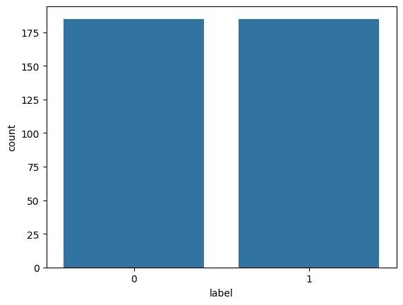
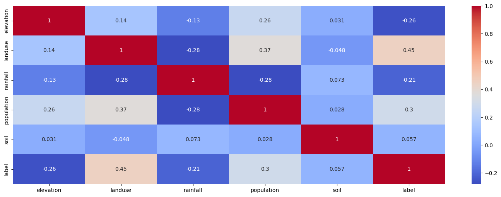
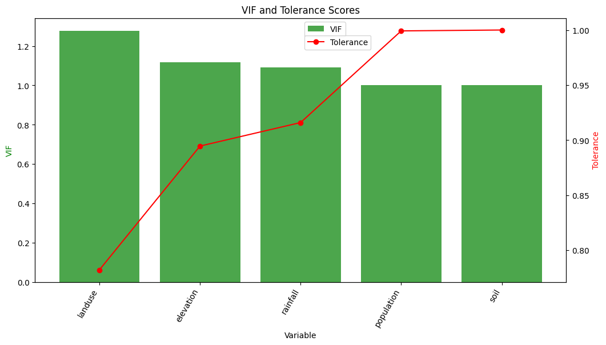
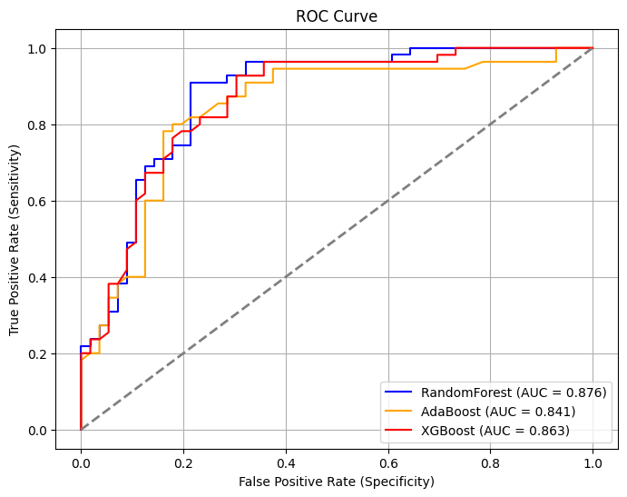
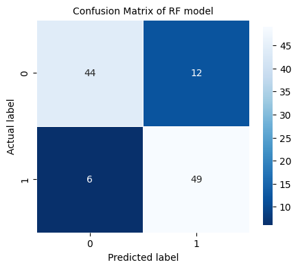
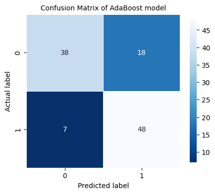
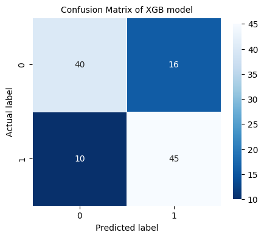
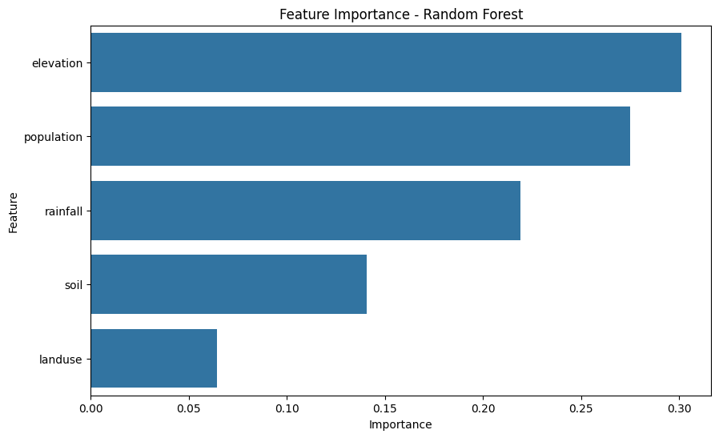

#  Hochwasser-Vorhersage mit Machine Learning

Machine-Learning-Projekt zur Vorhersage von Hochwasserrisiken mit Umwelt- und Geodaten.

Dieses Projekt vergleicht verschiedene Machine-Learning-Modelle für die Hochwasser-Vorhersage und bewertet ihre Leistung mit Klassifikationsmetriken und ROC-Analyse.

---

##  Projektübersicht

Dieses Projekt benutzt Geodaten und Umweltdaten, um gefährdete und nicht gefährdete Hochwassergebiete vorherzusagen.

Der Arbeitsprozess enthält:

- Datenvorverarbeitung
- Korrelationsanalyse
- Multikollinearitätsanalyse
- Datennormalisierung
- Modelltraining
- Hyperparameter-Optimierung
- Modellbewertung
- Speichern der Modelle für Deployment

Das Projekt vergleicht folgende Modelle:

- Random-Forest-Klassifikator
- AdaBoost-Klassifikator
- XGBoost-Klassifikator

Das beste Modell wurde gespeichert und später für die Webanwendung benutzt.

---

##  Verwendete Technologien

- Python
- GeoPandas
- Pandas
- NumPy
- Scikit-learn
- XGBoost
- Seaborn
- Matplotlib
- Joblib

---

##  Datensatz

Der Datensatz enthält Umwelt- und Geofaktoren zum Thema Hochwasser.

Beispielmerkmale:

- Elevation
- Rainfall
- Soil Type
- Land Use
- Population Density

Zielwerte:

- `0` → Kein Hochwasser
- `1` → Hochwasser

---

##  Datenanalyse

### Verteilung des Datensatzes

Der Datensatz enthält Hochwasser- und Nicht-Hochwasser-Beispiele.



---

### Korrelations-Heatmap

Pearson-Korrelationsanalyse zwischen den Merkmalen.



---

### VIF- und Toleranzanalyse

Multikollinearitätsanalyse mit VIF- und Toleranzwerten.




---

## 📈 Modellbewertung

Die Modelle wurden bewertet mit:

- Genauigkeit
- Sensitivität
- Spezifität
- Cohen-Kappa-Score
- ROC-Kurve
- Konfusionsmatrix

---

##  Vergleich der ROC-Kurven

Vergleich der Modellleistung mit ROC-AUC.



---

##  Konfusionsmatrix

### Random Forest



### AdaBoost



### XGBoost



---

##  Wichtigkeit der Merkmale

Merkmalswichtigkeit aus dem Random-Forest-Modell.



---

##  Gespeicherte Modelle

Die trainierten Modelle sind gespeichert in:

```text
model_pkl/
```

Gespeicherte Dateien:

```text
RandomForest_model.pkl
AdaBoost_model.pkl
XGBoost_model.pkl
```

---

##  Projekt lokal ausführen

Repository klonen:

```bash
git clone <repo-url>
cd ML_Flood_Prediction
```

Abhängigkeiten installieren:

```bash
pip install -r requirements.txt
```

Notebook-Skripte ausführen.

---

##  Verwandtes Projekt

Webanwendung für Deployment:
[ML Flood Prediction Website](https://github.com/ololades/ML_Flood_Prediction_Website)

---
